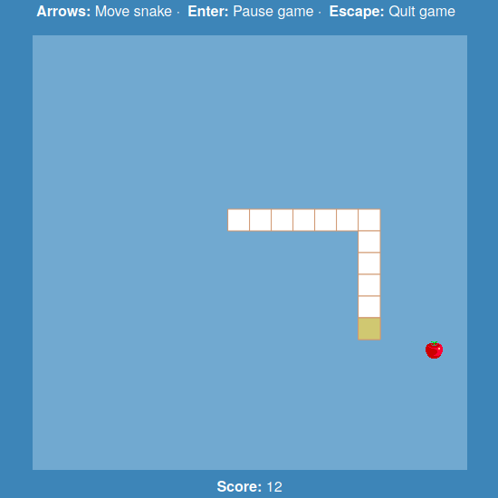

# Snake
Classic snake game implemented with [p5.js]



[p5.js]: https://p5js.org

# Installation
```bash
npm install
```

# Building
Initial build with:

```bash
gulp build
```

For automatic browser reloading during development:

```bash
gulp watch
```

# Deployment on Github
Following this [tutorial on medium], we create a new branch:

```bash
git checkout --orphan gh-pages
rm -rf .
git add .
git commit --allow-empty -m "New branch"
git push origin gh-pages
```

Create a worktree inside `dist/` folder and associate it with new branch. Then build project:

```bash
git worktree add dist gh-pages
gulp build
```

Now whenever you go inside `dist/` folder, the branch changes automatically. So you just have to commit `dist/` folder:

```bash
cd dist
git add .
git commit -m "publish game on github"
git push origin gh-pages
```

Follow this [link to the game].

[tutorial on medium]: https://medium.com/linagora-engineering/deploying-your-js-app-to-github-pages-the-easy-way-or-not-1ef8c48424b7
[link to the game]: https://h4k1m0u.github.io/p5-snake/

# Assets
- **Apple sprite:** [Good Fruits] by [Master484], license: Public Domain.
- **Music:** [Cyberpunk Moonlight Sonata] by Joth.

[Good Fruits]: https://opengameart.org/content/good-fruits-m484-games
[Master484]: https://m484games.ucoz.com/
[Cyberpunk Moonlight Sonata]: https://opengameart.org/content/cyberpunk-moonlight-sonata

# Credit
Inspired by [this tutorial] from [The Coding Train] youtube channel

[this tutorial]: https://www.youtube.com/watch?v=AaGK-fj-BAM
[The Coding Train]: https://www.youtube.com/channel/UCvjgXvBlbQiydffZU7m1_aw

# p5.js
The instantiation of p5 inside a scope works using closures (inner functions) similary to the example below. Note that modification of objects (i.e. this) elements inside a function persist outside the function:

```javascript
function outer(p) {
    p.draw = () => {
        console.log('p.init function');
    }
}

class MyClass {
    constructor(closure) {
        // add this.draw() method to this object
        closure(this);
    }
}

const myObj = new MyClass(outer);
myObj.draw();
```
